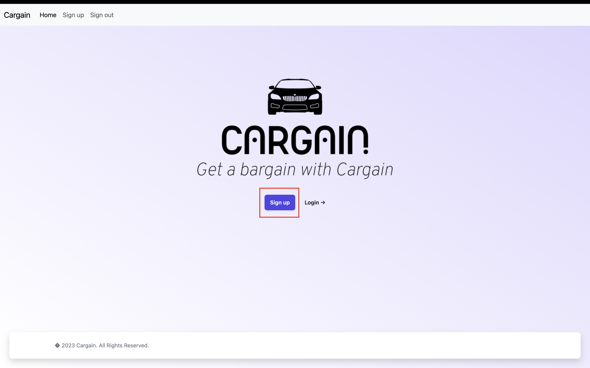
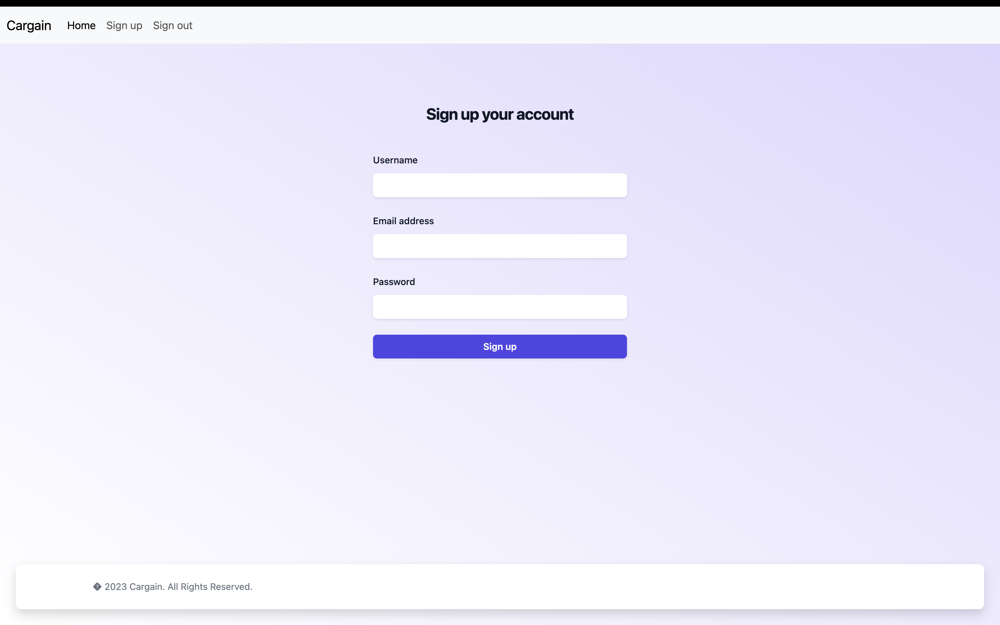
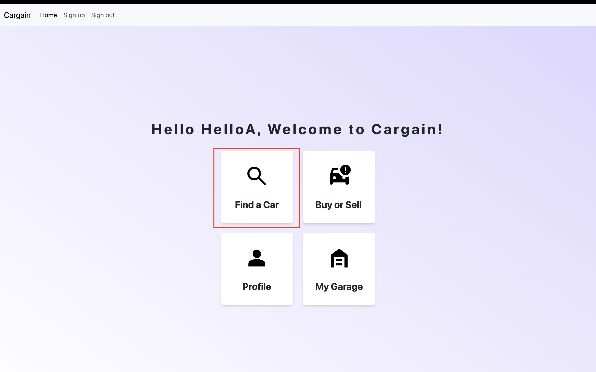
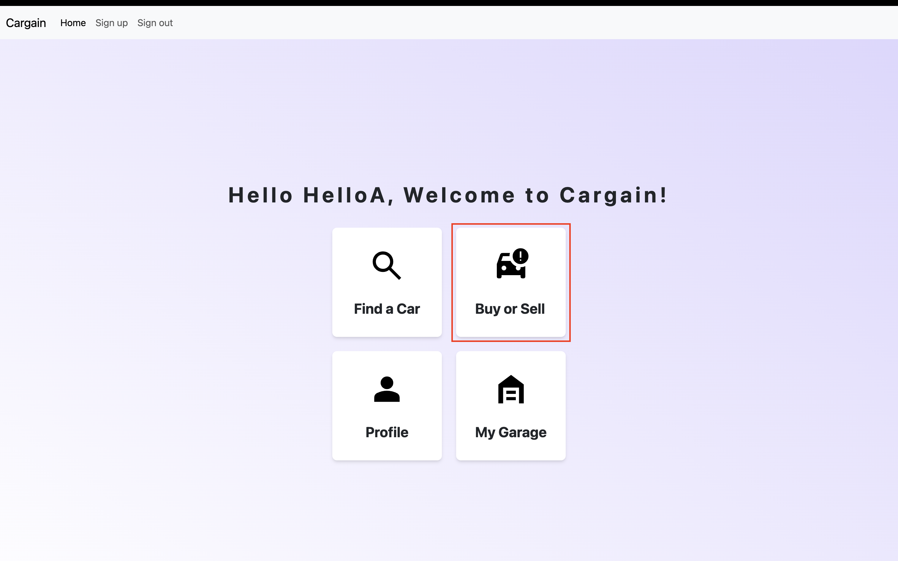

# 2800-202310-BBY32


## Project Pitch
Our project, Cargain, is developing AI powered used car price estimator to help people who are new to the used car market find reliable and affordable vehicles with Linear regressions and generative AI

## Technologies 
EJS, Python, CSS, Javascript, MongoDB, OpenAI API, Node, Tailwind, Bootstrap, Vercel

## Directory Structure
```bash
├── Create Models
│   ├── extract.py
│   ├── prediction.py
│   └── short.csv
├── README.md
├── Tree.txt
├── index.js
├── js
│   ├── databaseConnection.js
│   ├── easterEgg.js
│   └── tailwind.config.js
├── models
│   ├── encoders
│   ├── imputers
│   ├── price_prediction.joblib
│   └── v0.1_price_prediction.joblib
├── node_modules
│   ├── @alloc
│   ├── @aws-crypto
│   ├── @aws-sdk
│   ├── @babel
│   ├── @emailjs
│   ├── @hapi
│   ├── @jridgewell
│   ├── @mapbox
│   ├── @nodelib
│   ├── @sideway
│   ├── @types
│   ├── abbrev
│   ├── accepts
│   ├── agent-base
│   ├── ansi-regex
│   ├── ansi-styles
│   ├── any-promise
│   ├── anymatch
│   ├── aproba
│   ├── archetype
│   ├── are-we-there-yet
│   ├── arg
│   ├── array-flatten
│   ├── asn1.js
│   ├── async
│   ├── asynckit
│   ├── axios
│   ├── axios-retry
│   ├── balanced-match
│   ├── base64-js
│   ├── bcrypt
│   ├── binary-extensions
│   ├── bluebird
│   ├── bn.js
│   ├── body-parser
│   ├── bowser
│   ├── brace-expansion
│   ├── braces
│   ├── bson
│   ├── buffer
│   ├── buffer-shims
│   ├── bytes
│   ├── call-bind
│   ├── camelcase-css
│   ├── chalk
│   ├── chokidar
│   ├── chownr
│   ├── color-convert
│   ├── color-name
│   ├── color-support
│   ├── combined-stream
│   ├── commander
│   ├── concat-map
│   ├── connect
│   ├── connect-mongo
│   ├── connect-mongodb-session
│   ├── console-control-strings
│   ├── content-disposition
│   ├── content-type
│   ├── cookie
│   ├── cookie-signature
│   ├── core-util-is
│   ├── crypto-js
│   ├── cssesc
│   ├── debug
│   ├── delayed-stream
│   ├── delegates
│   ├── depd
│   ├── destroy
│   ├── detect-libc
│   ├── didyoumean
│   ├── dlv
│   ├── dotenv
│   ├── ee-first
│   ├── ejs
│   ├── emailjs
│   ├── emoji-regex
│   ├── encodeurl
│   ├── es6-promise
│   ├── escape-html
│   ├── etag
│   ├── express
│   ├── express-session
│   ├── express-sessions
│   ├── fast-glob
│   ├── fast-xml-parser
│   ├── fastq
│   ├── filelist
│   ├── fill-range
│   ├── finalhandler
│   ├── follow-redirects
│   ├── form-data
│   ├── formidable
│   ├── forwarded
│   ├── fresh
│   ├── fs-minipass
│   ├── fs.realpath
│   ├── fsevents
│   ├── function-bind
│   ├── gauge
│   ├── get-intrinsic
│   ├── glob
│   ├── glob-parent
│   ├── has
│   ├── has-flag
│   ├── has-symbols
│   ├── has-unicode
│   ├── hooks-fixed
│   ├── http-errors
│   ├── https-proxy-agent
│   ├── iconv-lite
│   ├── ieee754
│   ├── inflight
│   ├── inherits
│   ├── ip
│   ├── ipaddr.js
│   ├── is-binary-path
│   ├── is-core-module
│   ├── is-extglob
│   ├── is-fullwidth-code-point
│   ├── is-glob
│   ├── is-number
│   ├── is-retry-allowed
│   ├── isarray
│   ├── jake
│   ├── jiti
│   ├── joi
│   ├── kareem
│   ├── kruptein
│   ├── lilconfig
│   ├── lines-and-columns
│   ├── lodash
│   ├── lodash.clonedeep
│   ├── lodash.get
│   ├── lodash.set
│   ├── lru-cache
│   ├── make-dir
│   ├── media-typer
│   ├── memory-pager
│   ├── merge-descriptors
│   ├── merge2
│   ├── methods
│   ├── micromatch
│   ├── mime
│   ├── mime-db
│   ├── mime-types
│   ├── minimalistic-assert
│   ├── minimatch
│   ├── minipass
│   ├── minizlib
│   ├── mkdirp
│   ├── mongodb
│   ├── mongodb-connection-string-url
│   ├── mongodb-core
│   ├── mongoose
│   ├── mpath
│   ├── mpromise
│   ├── mquery
│   ├── ms
│   ├── muri
│   ├── mz
│   ├── nanoid
│   ├── negotiator
│   ├── node-addon-api
│   ├── node-fetch
│   ├── nodemailer
│   ├── nopt
│   ├── normalize-path
│   ├── npmlog
│   ├── object-assign
│   ├── object-hash
│   ├── object-inspect
│   ├── on-finished
│   ├── on-headers
│   ├── once
│   ├── openai
│   ├── parseurl
│   ├── path-is-absolute
│   ├── path-parse
│   ├── path-to-regexp
│   ├── picocolors
│   ├── picomatch
│   ├── pify
│   ├── pirates
│   ├── postcss
│   ├── postcss-import
│   ├── postcss-js
│   ├── postcss-load-config
│   ├── postcss-nested
│   ├── postcss-selector-parser
│   ├── postcss-value-parser
│   ├── process-nextick-args
│   ├── proxy-addr
│   ├── proxy-from-env
│   ├── punycode
│   ├── qs
│   ├── queue-microtask
│   ├── random-bytes
│   ├── range-parser
│   ├── raw-body
│   ├── read-cache
│   ├── readable-stream
│   ├── readdirp
│   ├── redis
│   ├── regenerator-runtime
│   ├── regexp-clone
│   ├── require_optional
│   ├── resolve
│   ├── resolve-from
│   ├── reusify
│   ├── rimraf
│   ├── run-parallel
│   ├── safe-buffer
│   ├── safer-buffer
│   ├── saslprep
│   ├── semver
│   ├── send
│   ├── serve-static
│   ├── set-blocking
│   ├── setprototypeof
│   ├── side-channel
│   ├── signal-exit
│   ├── sliced
│   ├── smart-buffer
│   ├── socks
│   ├── source-map-js
│   ├── sparse-bitfield
│   ├── statuses
│   ├── string-width
│   ├── string_decoder
│   ├── strip-ansi
│   ├── strnum
│   ├── sucrase
│   ├── supports-color
│   ├── supports-preserve-symlinks-flag
│   ├── tailwindcss
│   ├── tar
│   ├── thenify
│   ├── thenify-all
│   ├── to-regex-range
│   ├── toidentifier
│   ├── tr46
│   ├── ts-interface-checker
│   ├── tslib
│   ├── type-is
│   ├── uid-safe
│   ├── unpipe
│   ├── util-deprecate
│   ├── utils-merge
│   ├── uuid
│   ├── vary
│   ├── webidl-conversions
│   ├── whatwg-url
│   ├── wide-align
│   ├── wrappy
│   ├── yallist
│   └── yaml
├── package-lock.json
├── package.json
├── public
│   ├── car-crash.svg
│   ├── car.png
│   ├── garage-home.svg
│   ├── home-logo.png
│   ├── logo.ico
│   ├── logo.png
│   ├── person.svg
│   └── search.svg
├── py_scripts
│   ├── Procfile
│   ├── readme.txt
│   ├── requirements.txt
│   ├── runtime.txt
│   ├── server.py
│   └── valid_inputs.json
├── style
│   ├── loggedin.css
│   └── styles.css
├── vercel.json
└── views
    ├── 404.ejs
    ├── ActualResetPage.ejs
    ├── chatbot.ejs
    ├── createUser.ejs
    ├── createUserFail.ejs
    ├── index.ejs
    ├── loggedin-info.ejs
    ├── loggedin.ejs
    ├── loggedout.ejs
    ├── login.ejs
    ├── loginfail.ejs
    ├── passwordReset.ejs
    ├── passwordResetEmailFail.ejs
    ├── passwordResetEmailSent.ejs
    ├── passwordResetSuccess.ejs
    ├── predict.ejs
    ├── pricechat.ejs
    ├── scripts
    ├── submitEmail.ejs
    ├── submitError.ejs
    ├── submitUser.ejs
    ├── templates
    ├── tokenExpired.ejs
    └── userProfile.ejs
```

## How to Run on your Machine

<b>Languages</b>: Python, Javascript, CSS \
\
<b>IDE</b>: Recommended is VS Code but something like PHP Storm will likely work as well \
\
<b>Databases</b>: Will need to set up a MongoDB database to connect to \
\
<b>Other Software</b>: Need to download Node\
\
<b>Enviroment Variables</b>: The enviroment variables you need are: 
```
MONGODB_HOST
MONGODB_USER
MONGODB_PASSWORD
MONGODB_DATABASE
MONGODB_SESSION_SECRET
NODE_SESSION_SECRET
EMAIL_PASSWORD
OPENAI_API_KEY
``` 
\
<b>Third Party API's</b>: Will need a API key for ChatGPT to use any of the chat bots on the site \
\
<b>Instructions to run</b>: After installing everything needed here are the steps to run the code: 
1. Open a terminal window
2. CD to the location of the project repo
3. Type the command ```node index.js``` into the terminal
4. Go to web browser and type in ```localhost:3000```
5. Your Done! The webpage should be up and running on this host

<b>Testing Sheet</b>: https://docs.google.com/spreadsheets/d/1Bi82VyTT5YOWnhw9vpYHLW4Sh8o6rsQfeRThbktHTJ0/edit?usp=sharing

## How to use

These steps will help you get started using the web app: 

1. On the landing page select the <i>Sign up</i> button: 

</img>

2. Fill out all of the fields with your information:



3. Now you will be greeted with 4 options from which you can choose what to do next:

    a. If your unsure of which car is right for you select *find a car* where you will be meeted with a chatbot that will help you decide what is right for you:

    

    b. If you know what car you want to buy and just want to see what the price of that car is estimated to be you can select *Buy or Sell* where another chatbot will ask for information about your car which we will use to estimate the price:

    

    c. Those are the main two pages of the website the profile page is just to edit information about your profile like email, name, bio, and profile image and the garage page is just to quickly see your saved cars estimated prices

## Credits and References

This needs to be filled out still

## How we used AI

We used AI for a multitude of things in our application:

1. We used the AI ChatGPT to help us troubleshoot issues mainly and occasionally to help with styling elements of pages

2. We use a dataset we got from Kaggle to train a linear regression model to predict prices of cars using python

3. The web app also uses AI in the recommendation chat bot in order to recommend the user a car and in the price prediction chat bot in order to get the information needed from the user to predict the price of their car

The biggest limitation we encountered was with the ChatGPT AI rate limiting us a lot when we made requests to in order to get around this we implemented a wait time of 3 seconds before we make the request so we don't send to many requests to quickly and get errors. In case we still do we also have a error message prompting the user to just type their message again as the API will still work normally if you just re send your message.

## Contact Information

To contact us please email us at ```raulakh16@my.bcit.ca```